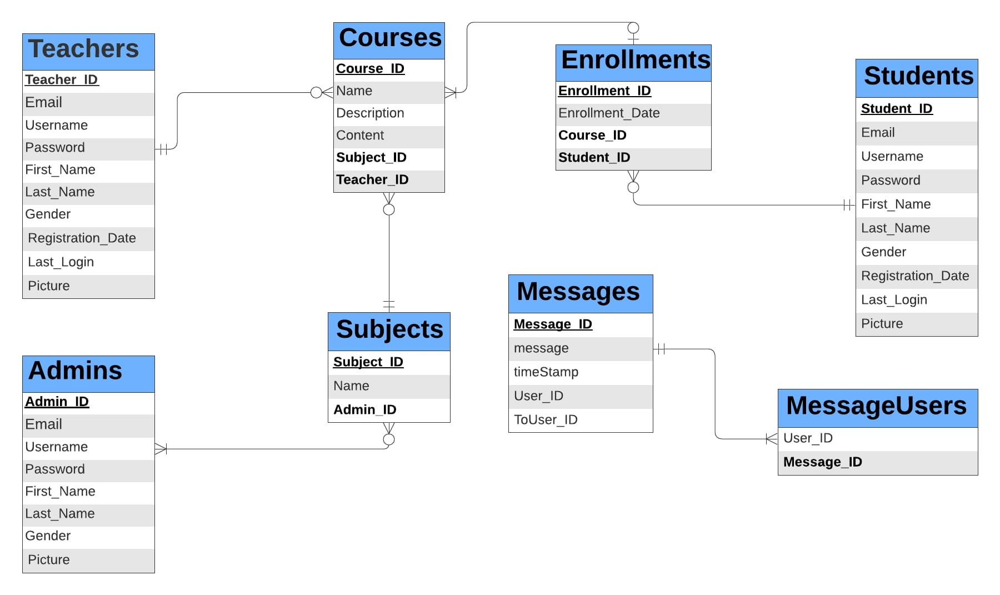
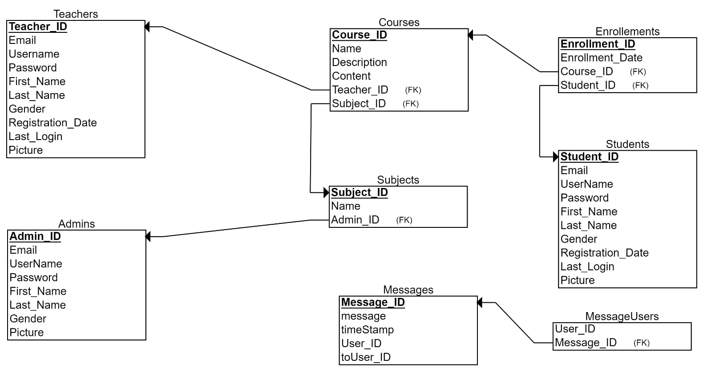

# **E-Learning System**

**How to run the Project:**
1. Clone this repo using 
   - `git clone https://github.com/SuwaidAslam/E-Learning-System-Java-GUI-Application.git`
2. Install Netbeans 8.2
3. Use WAMP server.
4. First create the MySql database on WAMP server using the sql file in the repo
5. And then build and run the LoadingScreen.java or Main.java file from the IDE. 

**Login Information** <br>
 ```
 username : admin
 password: admin 
 ```
 note: Super admin can add new admins
 
# INTRODUCTION: <br>
E-Learning System is a desktop-based Windows application developed in Java with Swing and AWT. This project aims at serving Students and Teachers in Online based learning. 
Admins can add subjects, Teachers can add courses in a particular subject and Students can Enroll courses and study them, and also Students can message other participants in a particular course except the Teacher teaching that course.

**Hardware and software tools:**<br>
The system services and goals are established by consultation with system user. They are then defined in details and serve as a system specification. System requirement are those on which the system runs.<br><br>

⚙️    Hardware Requirements:<br>
o     Computer with either Intel Pentium processor or AMD processor.<br>
o     1GB+ DDR RAM<br>
o     1GB hard disk drive<br>


💻    Software Requirements:<br>
o     Windows Operating system.<br>
o     JRE and JDK.<br>	
o     MySQL server (WAMP)<br>

# DESIGN<br>
Database Design is a collection of processes that facilitate the designing, development, implementation and maintenance of enterprise data management systems.<br>
It helps produce database systems:<br>
o   That meet the requirements of the users<br>
o   Have high performance.<br>

**Architecture Description** <br>
The design of a DBMS depends on its architecture. It can be centralized or decentralized or hierarchical. The architecture of a DBMS can be seen as either single tier or multi-tier.<br><br>
**ER Diagram**


Fig 1: ER Diagram <br><br>
An entity–relationship model describes interrelated things of interest in a specific domain of knowledge (Refer Fig 1). It is composed of entity types and specifies relationships that can exist between instances of those entity types.

**Relational Schema Diagram**



 Fig 2: Relational Schema <br><br>
Relational schema is a collection of meta-data. Database schema describes the structure and constraints of data representing in a particular domain (Refer Fig 2).

# IMPLEMENTATION <br>
**Description on Implementation**<br>
The goal of this application is to manage the Students, Teachers, Courses and various functions of E-Learning System.

**List of modules with use cases:**<br>
This Java project consists of 3 major modules
*  ***Admin***<br>
   * Admin Login with Username & Password<br>
   * View Profile<br>
   * View Account Information<br>
   * Delete Account<br>
   * Manage Account (Change email, change name, change profile, change password)<br>
   * Admin Adds Subject<br>
   * Admin Deletes Subject<br>
   * View All Teachers Details and Delete Teacher<br>
   * View All Students Details and Delete Student<br>
   * View All Courses Details<br>
   * Add New Admin<br>
   * Logout<br>
*  ***Teacher***<br>
   *  Signup<br>
   *  Teacher Login with Username & Password<br>
   *  View Profile<br>
   *  View Account Information<br>
   *  Delete Account<br>
   *  Manage Account (Change email, change name, change profile, change password)<br>
   *  Teacher Adds Course<br>
   *  View My Students in a Particular course.<br>
   *  View My Courses<br>
   *  Update My Course<br>
   *  Logout<br>
*  ***Student***<br>
   *  Signup<br>
   *  Student Login with Username & Password<br>
   *  View Profile<br>
   *  View Account Information<br>
   *  Delete Account<br>
   *  Manage Account (Change email, change name, change profile, change password)<br>
   *  Student Enrols Courses<br>
   *  Student Study Courses<br>
   *  Student Withdraw Courses<br>
   *  Student Views Participants in a particular course.<br>
   *  Student can Message any participant in a particular course except Teacher.<br>
   *  Logout<br>


